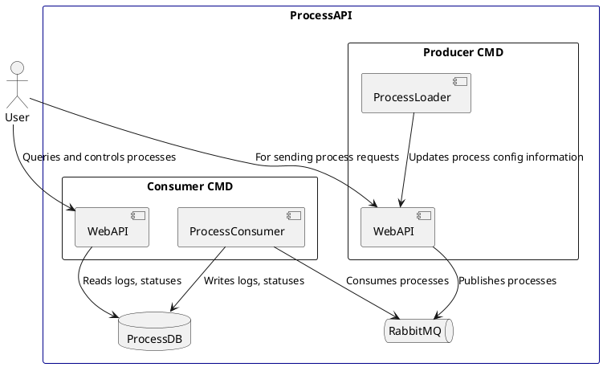

# Processing API – C4 Diagram

The Processing API is designed to accept different process command requests and execute them locally or remotely via SSH. File copy command to a remote machine is also supported. It handles process validation, queuing via RabbitMQ, and parallel processing through different type of executors. Below is a **Container Level View** of the system.

## Container
